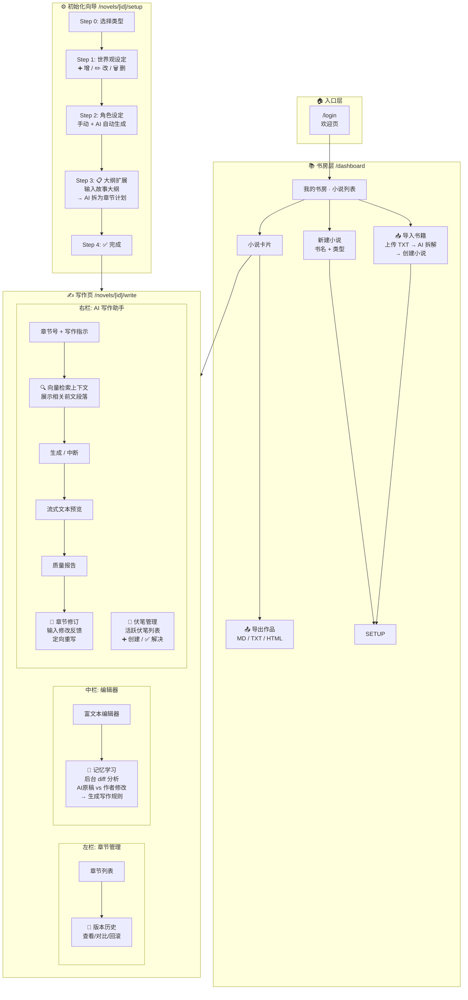

# 墨庐前端功能扩展规划

## 完整用户流程图



---

## 各功能详细落位

### 📥 书籍导入 — 放在 `/dashboard` 书房首页

```
┌─────────────────────────────────────────┐
│  我的书房                                 │
│  ┌──────────┐  ┌──────────────┐         │
│  │➕ 新建小说│  │📥 导入书籍   │  ← 新增  │
│  └──────────┘  └──────────────┘         │
│              ↑ 点击弹出上传 Modal        │
│              · 拖拽/选择 TXT 文件        │
│              · AI 自动拆解为结构化数据    │
│              · 生成小说 + 角色 + 世界观   │
└─────────────────────────────────────────┘
```

**交互流程**: 点击「导入书籍」→ Modal 弹出 → 上传 TXT → 后端 `POST /api/v1/books/import` → AI 逆向拆解 → 自动创建 Novel + Characters + World → 跳转到 SetupWizard 供用户确认/调整

---

### ✏️ 世界观编辑（增删改） — 放在 SetupWizard Step 1

```
┌─────────────────────────────────────────┐
│  世界观设定                               │
│  ┌──────────────────────────────────┐   │
│  │ 九天大陆: 修仙者居住的主世界  ✏️ 🗑️ │   │
│  │ 灵气体系: 天地灵气为修炼根源  ✏️ 🗑️ │   │
│  │ 上古遗迹: 万年前仙魔大战遗址  ✏️ 🗑️ │   │
│  └──────────────────────────────────┘   │
│  [+ 名称] [+ 描述] [类型▾] [➕ 添加]     │
│                    ↑ 已有元素卡片上增加   │
│                    编辑/删除按钮          │
└─────────────────────────────────────────┘
```

---

### 📋 大纲扩展 — 放在 SetupWizard 新增 Step 3（原 Step 3 完成 → Step 4）

```
┌─────────────────────────────────────────┐
│  大纲扩展                                 │
│  ┌──────────────────────────────────┐   │
│  │ 输入故事大纲（500-2000字）          │   │
│  │                                    │   │
│  │ 主角林枫出身寒门，意外获得上古剑     │   │
│  │ 魂传承，踏上修仙之路。经历宗门大     │   │
│  │ 比、秘境探险、正魔大战，最终成为     │   │
│  │ 一代剑仙……                         │   │
│  │                                    │   │
│  └──────────────────────────────────┘   │
│  [🤖 AI 拆解为章节计划]                   │
│                                          │
│  拆解结果:                                │
│  ┌────┬─────────────────────────────┐   │
│  │ 1  │ 寒门少年，剑魂觉醒           │   │
│  │ 2  │ 初入青云宗，外门考核         │   │
│  │ 3  │ 剑魂初显威，内门选拔         │   │
│  │ .. │ ...                         │   │
│  └────┴─────────────────────────────┘   │
│  [✏️ 手动调整] [✅ 确认，开始写作]         │
└─────────────────────────────────────────┘
```

**触发时机**: 角色设定完成后，给用户一个选项：手动逐章写作 / 先规划大纲再展开
**后端**: `expand_outline_to_chapters()` — 将大纲节点展开为 N 个章节计划（目前是 NotImplementedError，需实现）

---

### 🔍 向量检索上下文 — 放在 GeneratePanel 生成面板中

```
┌─────────────────────────────────────────┐
│  AI 写作助手                              │
│  ┌──────────────────────────────────┐   │
│  │ 章 节: [3]                        │   │
│  │ 写作指示: [主角突破金丹期...]      │   │
│  └──────────────────────────────────┘   │
│  ┌──────────────────────────────────┐   │
│  │ 🔍 相关前文 (向量检索)      ← 新增 │   │
│  │ ┌──────────────────────────────┐ │   │
│  │ │ 第1章: "林枫盘膝而坐，灵气的   │ │   │
│  │ │        涌动越来越剧烈..."     │ │   │
│  │ │ 第2章: "丹田之内，一缕金色剑   │ │   │
│  │ │        意正在缓缓成型..."     │ │   │
│  │ └──────────────────────────────┘ │   │
│  └──────────────────────────────────┘   │
│  [⚡ 生成第 3 章]                        │
│  ...                                    │
└─────────────────────────────────────────┘
```

**用途**: 在生成新章节前，用当前写作指示（用户输入）做语义检索，找到前文中与用户关注点最相关的段落 → 注入 `context_layers` → Writer 写得更连贯
**后端**: `vector_memory.search_similar()` 已实现

---

### 🧠 记忆学习 — 在写作页编辑器中后台运行

```
用户手动修改 AI 生成的章节正文
        │
        ▼
┌───────────────────────────────────────┐
│  保存修改时触发                         │
│  memory.learn_from_edit()             │
│  · AI 原稿 (chapter.content)          │
│  · 作者修改稿 (编辑器当前内容)          │
│  · diff → 提取模式                    │
│  · 存入 memory_rules 表               │
└───────────────────────────────────────┘
        │
        ▼
  下次生成章节时，MemoryRule 注入 prompt
  → AI 遵循作者偏好，越写越像本人
```

**展示位置**: 可在 GeneratePanel 底部新增一个可折叠的「📝 已学习规则」区域，展示当前小说积累的写作规则（anti-ai 模式 / 风格偏好）

```
┌──────────────────────────────────┐
│ 📝 已学习规则 (3条)      ← 新增  │
│ ┌──────────────────────────────┐ │
│ │ 🚫 避免"眼中闪过"  优先级: 8 │ │
│ │ 🚫 减少"身形一震"  优先级: 6 │ │
│ │ ✏️ 偏好短句战斗描写 优先级: 5 │ │
│ └──────────────────────────────┘ │
└──────────────────────────────────┘
```

---

### 📜 版本历史 — 放在左栏章节列表中

```
┌─ 左栏 ──────────────────────────┐
│  ← 墨庐 · 剑道独尊              │
│───────────────────────────────── │
│  📄 第3章 ✓                     │
│  ┌─ 版本历史 ──────────────┐    │
│  │ v3  2026-06-04 15:32 当前│    │
│  │ v2  2026-06-04 14:20     │    │
│  │     "Revision requested" │    │
│  │ v1  2026-06-04 13:00     │    │
│  │     "Initial generation" │    │
│  │ [对比] [回滚]             │    │
│  └──────────────────────────┘    │
│  📄 第2章 ✓                     │
│  📄 第1章 ✓                     │
│───────────────────────────────── │
│  [+ 新建章节]                    │
│  [⚙ 世界观/角色]                 │
└─────────────────────────────────┘
```

**交互**: 右键/点击章节旁的版本图标 → 下拉展开版本列表 → 支持查看历史版本内容、diff 对比、回滚到某版本

---

### 🔧 章节修订 — 放在 GeneratePanel 质量报告下方

```
┌──────────────────────────────────┐
│  ⚠ 需修改                        │
│  Guardian: ❌ 有违规               │
│  Inspector: rewrite              │
│────────────────────────────────── │
│  修改反馈:                  ← 新增│
│  ┌──────────────────────────────┐│
│  │"战斗场面太冗长，缩短到300字，  ││
│  │ 增加主角内心独白"             ││
│  └──────────────────────────────┘│
│                                   │
│  [🔧 按反馈修订]  ← 定向修改     │
│  [🔄 完全重新生成] ← 从头来过    │
└──────────────────────────────────┘
```

**区别**: 
- 「重新生成」= 完整的 `write_chapter` → `review` 流水线
- 「按反馈修订」= 调用 `POST .../revise`，基于已有正文 + 反馈做定向修改，保留大部分内容

---

### 🎯 伏笔管理 — 放在右栏，GeneratePanel 下方新增面板

```
┌──────────────────────────────────┐
│ 🎯 伏笔管理                ← 新增│
│ ┌──────────────────────────────┐ │
│ │ 🟡 剑魂来历之谜              │ │
│ │    埋于: 第1章  目标: 第5章  │ │
│ │    [标记已解决] [编辑]       │ │
│ ├──────────────────────────────┤ │
│ │ 🟢 宗门内奸身份              │ │
│ │    埋于: 第2章  已解决: 第7章│ │
│ ├──────────────────────────────┤ │
│ │ 🔴 上古遗迹的秘密 (过期!)    │ │
│ │    埋于: 第3章  目标: 第6章  │ │
│ └──────────────────────────────┘ │
│ [+ 手动添加伏笔]                  │
│ [🤖 自动检测本章伏笔]             │
└──────────────────────────────────┘
```

---

### 📤 多格式导出 — 放在 Dashboard 小说卡片的导出按钮

```
┌─ 小说卡片 ──────────────────────┐
│  📖 剑道独尊                     │
│  仙侠 · 12,000字 · 连载中        │
│  ┌──────┐ ┌──────┐ ┌──────┐   │
│  │✏️ 继续│ │📤 导出│ │🗑️ 删除│   │
│  └──────┘ └──┬───┘ └──────┘   │
│         ┌────┴────┐             │
│         │ · Markdown│ ← 当前    │
│         │ · TXT   │             │
│         │ · HTML  │             │
│         └─────────┘             │
└────────────────────────────────┘
```

**交互**: 点击导出 → Dropdown 选择格式 → 下载

---

## 功能优先级建议

| 优先级 | 功能 | 原因 |
|--------|------|------|
| P0 高 | 世界观编辑 | SetupWizard 已有展示，补全交互即可 |
| P0 高 | 多格式导出 | 后端已支持，前端加一个 Dropdown |
| P0 高 | 章节修订 | 后端已实现，GeneratePanel 加反馈输入框 |
| P0 高 | 伏笔管理 | 后端已实现 CRUD+检测，前端加面板 |
| P1 中 | 书籍导入 | 独立功能，Dashborad 加按钮+Modal |
| P1 中 | 版本历史 | 后端已实现，左栏加展开组件 |
| P1 中 | 大纲扩展 | 需先实现后端 plot_expansion 逻辑 |
| P2 低 | 向量检索上下文 | 后端已有，前端展示+注入 prompt 路径 |
| P2 低 | 记忆学习 | 需设计规则展示和 prompt 注入机制 |
